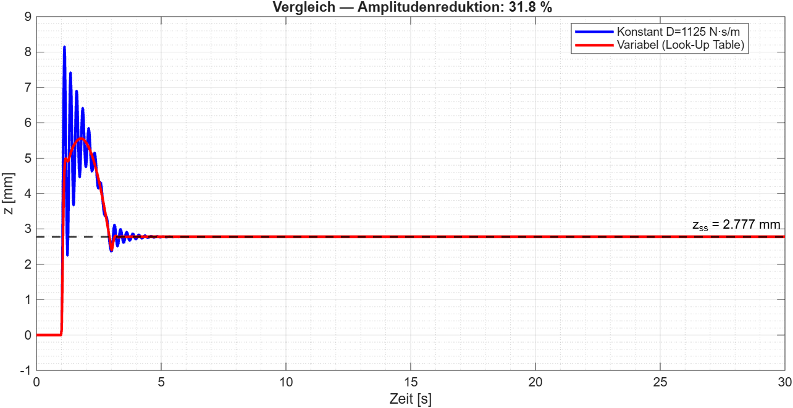
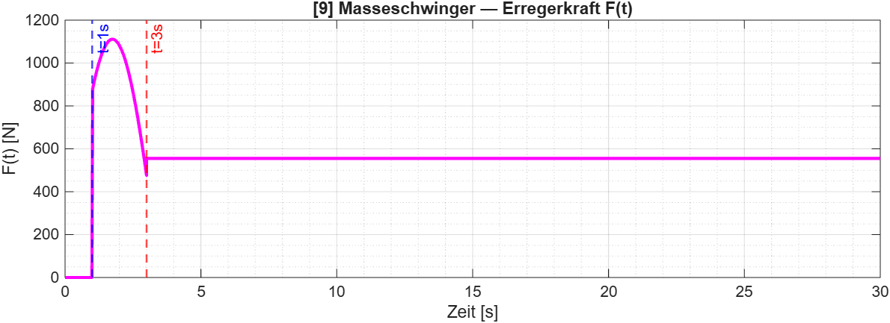
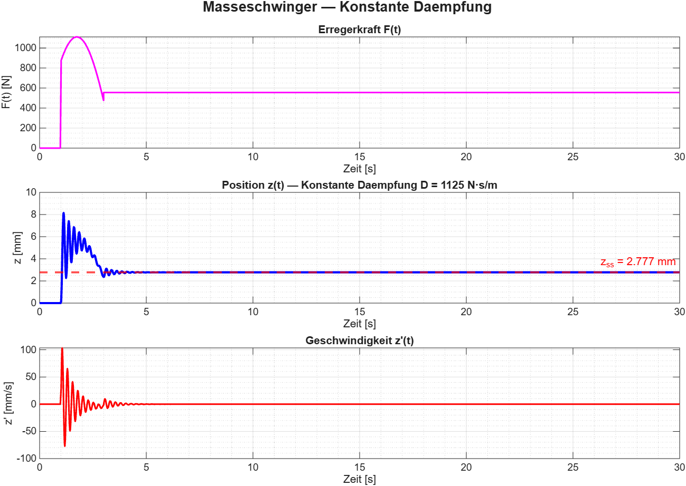
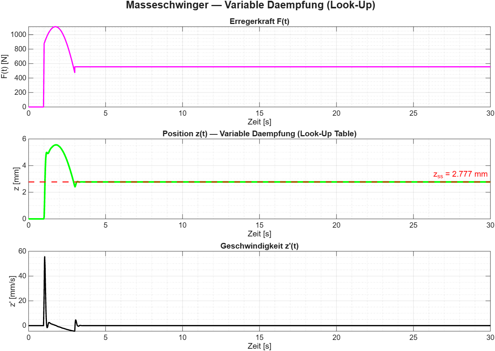

# Mass-Spring-Damper System Modeling in MATLAB and Simulink

## Overview

This repository contains the mathematical modeling, simulation, and analysis of a single-degree-of-freedom mass-spring-damper system implemented in MATLAB and Simulink.

The study compares two damping approaches:
* Linear viscous damping
* Nonlinear damping based on a 1-D Lookup Table

The objective is to evaluate the influence of damping characteristics on the transient and steady-state response of the system.

## Mathematical Model

The system dynamics are described by:

```
M·z'' + D·z' + C·z = F(t)
```

### Parameters

| Parameter                    | Value       |
| ---------------------------- | ----------- |
| Mass M                       | 300 kg      |
| Spring stiffness C           | 200 000 N/m |
| Damping coefficient D        | 1125 N·s/m  |
| Excitation force amplitude H | 1111 N      |
| Excitation frequency ω       | 0.9 rad/s   |
| Simulation step Δt           | 100 µs      |

> **Note:** The damping coefficient D = 1125 N·s/m applies to the linear model only.
> The nonlinear model uses a 1-D Lookup Table with values ranging from −433 N to 1300 N,
> depending on the instantaneous velocity z'.

## Repository Structure

```
Mass-Spring-Damper-MATLAB/
│
├── README.md
├── Masseschwinger.m
├── Masseschwinger_Konstant.slx
├── Masseschwinger_Variabel.slx
│
├── results/
│   ├── Vergleich.png
│   ├── Erregerkraft.png
│   ├── Konstante_Daempfung.png
│   ├── Variable_Daempfung.png
│   └── Daempfung_Look-Up_Table.png
│
└── presentation/
    └── Masseschwinger_Praesentation.pdf
```

| File                          | Description                           |
| ----------------------------- | ------------------------------------- |
| `Masseschwinger.m`            | MATLAB implementation using ODE23     |
| `Masseschwinger_Konstant.slx` | Simulink model with linear damping    |
| `Masseschwinger_Variabel.slx` | Simulink model with nonlinear damping |
| `results/`                    | Simulation plots and figures          |
| `presentation/`               | Project documentation and slides      |

## Results



| Metric                    | Linear Damping | Nonlinear Damping |
| ------------------------- | -------------- | ----------------- |
| Peak displacement         | 8.15 mm        | 5.56 mm           |
| Steady-state displacement | 2.775 mm       | 2.775 mm          |
| Settling time             | ~20 s          | ~4 s              |
| Amplitude reduction       | —              | 31.8 %            |

### Simulation Plots

| Plot | Description |
|------|-------------|
|  | Excitation force F(t) |
|  | Linear damping response |
|  | Nonlinear damping response |
|  | 1-D Lookup Table characteristic |

### System Characteristics

* Natural frequency: 25.82 rad/s
* Damping ratio: 0.0726
* Underdamped response

## Conclusion

Both damping models produce the same steady-state displacement. However, the nonlinear
damping model reduces the peak displacement by approximately 31.8% and significantly
decreases the settling time from ~20 s to ~4 s. The results demonstrate the effectiveness
of nonlinear damping characteristics for vibration suppression and dynamic response improvement.
